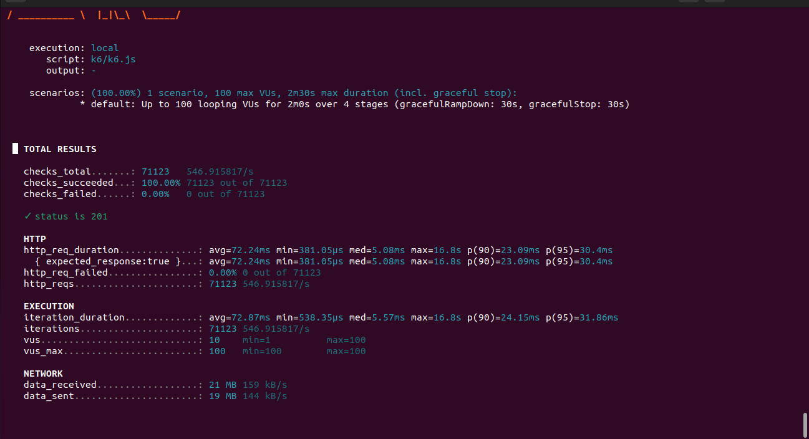

# murilo-pond-go-back

Projeto em Go para receber dados de telemetria por HTTP, enviar as mensagens para o RabbitMQ e salvar os dados no PostgreSQL com um consumidor assincrono.

## Servicos usados

- `backend`: API HTTP em Go com Gin
- `consumer`: consumidor da fila RabbitMQ
- `rabbitmq`: broker de mensageria
- `postgres`: banco de dados PostgreSQL
- `loadtesting`: k6 
## Como subir o projeto

Começe o banco de dados limpo:

```bash
docker compose down -v
```
Inicia a aplicação:
```bash
docker compose up --build
```

## Testar a aplicação e ver ele rodando

### 1. Ver os containers

```bash
docker compose ps
```

Os servicos esperados sao:

- `backend`
- `consumer`
- `rabbitmq`
- `postgres`

### 2. Testar o endpoint

```bash
curl -i -X POST http://localhost:8080/telemetry \
  -H "Content-Type: application/json" \
  -d "{
    \"device_id\": \"device-1\",
    \"timestamp\": \"2026-03-22T12:00:00Z\",
    \"sensor_type\": \"temperature\",
    \"reading_nature\": \"analog\",
    \"value\": 23.5
  }"
```
Resultado esperado:

- status `201 Created`

### 3. Ver se o dado foi salvo

```bash
docker exec -i postgres psql -U postgres -d telemetria -c "SELECT COUNT(*) FROM public.telemetry;"
```

Se aparecer pelo menos `1`, o fluxo esta funcionando.

## Teste de carga com k6

O teste de carga foi feito com o `k6`, simulando multiplos dispositivos enviando requisicoes ao mesmo tempo.

Para rodar:

```bash
k6 run k6/k6.js
```

## Resultado observado

No teste executado:

- até `100` VUs
- `4822` requisicoes
- `0%` de falha HTTP
- tempo medio de resposta de `1.44ms`
- `p95` de `2.06ms`

Isso mostra que, no cenario testado, o sistema respondeu bem e sem erros HTTP.

# ARQUITETURA

## Gin
Gin foi usado para montar a API HTTP em Go de forma simples e direta. Ele recebe e seta a rota `POST /telemetry`, faz o bind do JSON enviado no corpo da requisição, valida os dados recebidos e devolve a resposta HTTP. Como a aplicação precisava de uma API pequena com uma única rota principal e baixo acoplamento, o Gin foi a escolha ideal pela acessebilidade e facilidade de implementação.
## RabbitMQ
O RabbitMQ funciona como uma fila entre a API e o banco. O backend recebe a telemetria e coloca a mensagem na fila. Depois, o consumer pega essa mensagem e salva no PostgreSQL, ajudando a aplicação a suportar mais carga e não perder pacotes quando milhares de dispositivos estarem se comunicando com ela.
## Postegree
O PostgreSQL é um banco de dados amplamente usado e simples de trabalhar no contexto da aplicação. Além disso, por ser relacional, ele permite organizar as telemetrias em uma estrutura bem definida, com campos fixos e consistentes. Isso ajuda no armazenamento dos registros e também facilita consultas e análises futuras sobre os dados enviados pelos dispositivos.
## Middlewere
O middlewere recebe o JSON consumido da fila, converte esse conteúdo para a estrutura de telemetria da aplicação, valida os campos e, em seguida, envia os dados para inserção no PostgreSQL.
## k6
k6 é uma ferramenta de teste de carga usada para simular vários usuários ou dispositivos acessando a aplicação ao mesmo tempo. A carga foi dividida em etapas para aumentar o número de usuários de forma gradual, em vez de subir tudo de uma vez. Assim, o teste começa com 10 VUs por 30s, depois sobe para 50, depois para 100, e no final volta para 0. Isso ajuda a observar como a aplicação reage a diferente niveis de estresse.



Os resultados mostram que o sistema conseguiu lidar com até 100 usuários virtuais simultâneos sem falhas no HTTP. O sistema alcançou um throughput de cerca de 546,91 requisições por segundo. A latência média foi de 72,24ms, enquanto o p95 ficou em 30,4ms. Isso indica que a maior parte das requisições e etapas de requisições foi respondida rapidamente, mas houve alguns picos de lentidão, percebidos pelo valor máximo de 16,8s de espera.

Este gargalo indica alguma inificiencia em alguma etapa do processo. Como a rota api apenas encaminha para a fila do rabbitMQ, istó endica que a lentidão está sendo provocada no consumo das mensagens, na gravação no Postgree ou uma combinação dos dois. 

## REFERENCIAS USADAS
referencias:
https://gin-gonic.com/en/docs/routing/query-and-post-form/
https://go.dev/doc/tutorial/web-service-gin
https://docs.docker.com/guides/golang/build-images/
https://www.youtube.com/watch?v=rwReyPLmMs8
https://www.rabbitmq.com/tutorials/tutorial-one-go
https://ttemporin.dev/como-conectar-e-fazer-crud-em-um-banco-postgresql/
https://docs.docker.com/compose/intro/compose-application-model/
https://github.com/Murilo-ZC/projeto-psa-inteli-m9-2026-1/blob/main/ex-teste-go/projeto/server_test.go
